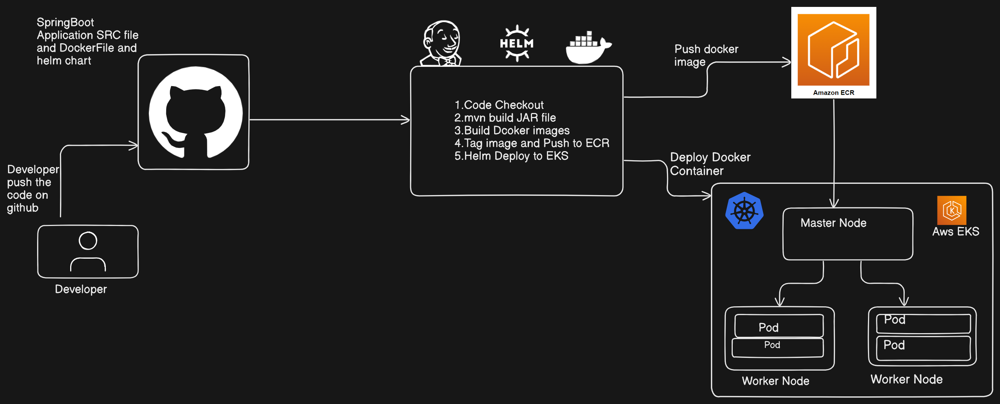
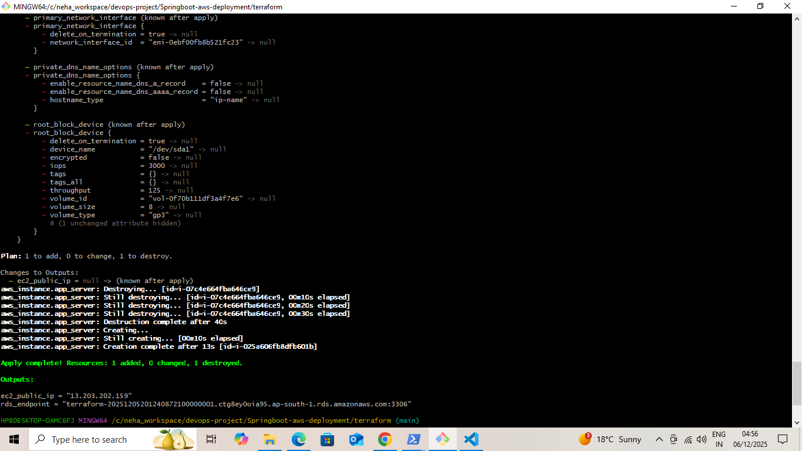
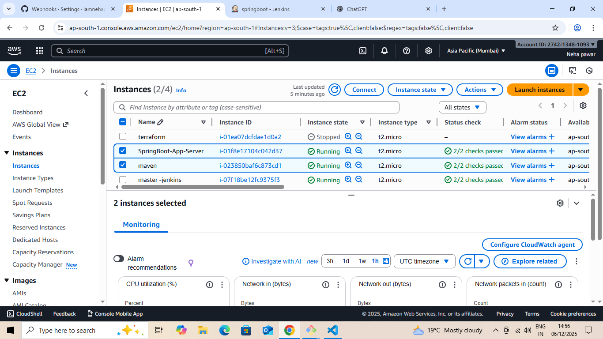
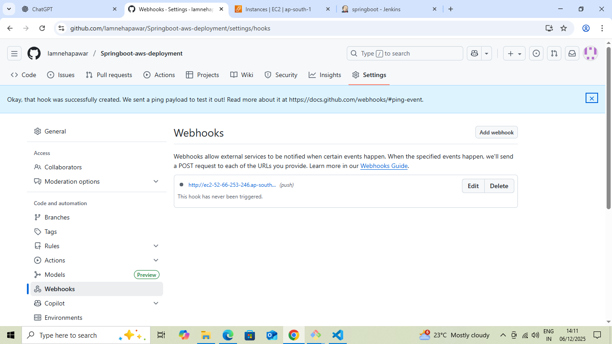
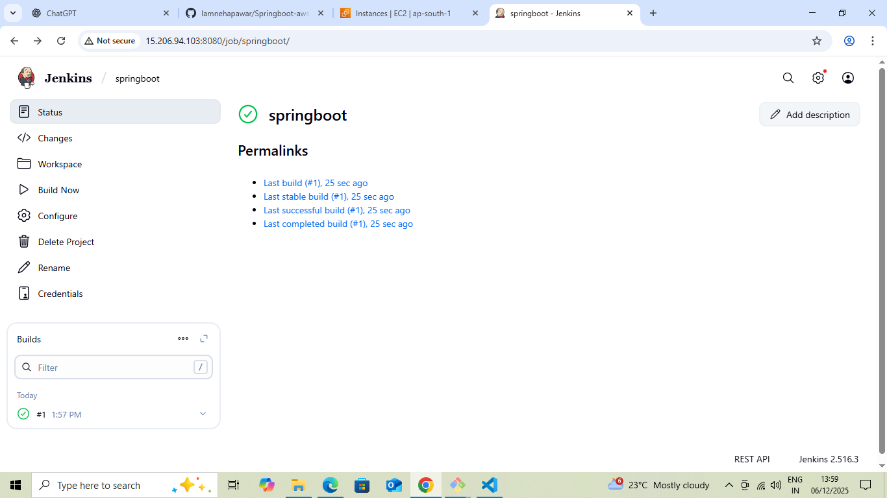

#  Deploying an E-Commerce Spring Boot Application on AWS EC2 + RDS Using Terraform & Jenkins  
*A Complete End-to-End CI/CD + IaC Project*

This project demonstrates how to deploy a production-ready **E-Commerce Spring Boot Application** on AWS using a fully automated DevOps stack. The solution integrates **Terraform** for Infrastructure as Code and **Jenkins** for CI/CD automation, delivering a seamless workflow from code push to deployment.

---

##  Architecture Overview  
A high-level architecture showing interactions between EC2, RDS, Jenkins, GitHub, and Terraform.



---

##  Step 1: Provision AWS Infrastructure with Terraform  

Using Terraform, the entire cloud infrastructure was automatically deployed.

### Provisioned Resources  
- EC2 Ubuntu Instance  
- RDS (MySQL/PostgreSQL)  
- VPC, Subnets, Routing  
- Security Groups (EC2 ↔ RDS)  
- IAM Roles  

### Terraform Commands  
```bash
terraform init
terraform plan
terraform apply --auto-approve
```





---

##  Step 2: SSH into EC2 Using Git Bash & Deploy Spring Boot App  

Terraform output didn't return the EC2 Public IP via command, so Git Bash was used for manual SSH access.


### Commands Executed on EC2  
```bash
sudo apt update -y
sudo apt install openjdk-17-jdk -y

# Upload the application JAR
scp -i key.pem target/app.jar ubuntu@EC2_PUBLIC_IP:/home/ubuntu/

# Run the application
nohup java -jar app.jar &
```

---

##  Step 3: Configure AWS RDS for the Application  

- Terraform provided the RDS endpoint  
- Updated `application.properties` with DB URL, username, password  
- Enabled EC2 ↔ RDS connectivity using Security Groups  


---

##  Step 4: CI/CD Automation Using Jenkins + GitHub Webhooks  

A fully automated Jenkins pipeline handles builds and deployments.

### Pipeline Highlights  
- GitHub webhook triggers pipeline automatically  
- Maven builds the Spring Boot application  
- Jenkins uploads the JAR to EC2 via SCP  
- Jenkins runs remote SSH commands to restart the application  

### webhook screenshot


###  Jenkins Build Screenshot  


---

### CI/CD Flow Summary  

1. Developer pushes code → GitHub  
2. Webhook triggers Jenkins  
3. Jenkins builds the app using Maven  
4. Jenkins transfers the JAR to EC2  
5. Jenkins runs SSH commands to restart app  
6. Spring Boot app becomes live on EC2  
7. EC2 communicates with RDS for database operations  

---

##  Final Output  

A fully automated production-grade DevOps pipeline built using:

✔ Terraform (IaC)  
✔ Jenkins (CI/CD)  
✔ GitHub Webhooks  
✔ AWS EC2 for deployment  
✔ AWS RDS for persistent storage  


---

##  Conclusion  

This project showcases a complete real-world DevOps workflow combining **Terraform, Jenkins, GitHub, AWS EC2, AWS RDS, and Spring Boot**.  
It is ideal for **Medium articles, LinkedIn portfolio posts, and professional DevOps case studies**.

---

